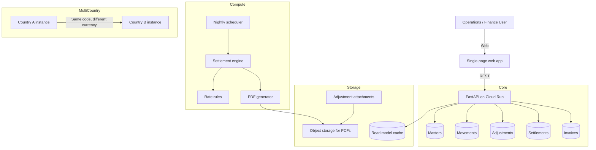

# Fleet Settlement Platform

> Public case study — sanitized for portfolio use.  
> Production system source: private corporate repository.

---

## Problem

A logistics company works with hundreds of contracted vehicles and drivers across many depots. Each depot used its own spreadsheets to track who drove which vehicle on which day, under which commercial agreement, and how much the contractor should be paid.

This caused several problems:

- Master data (drivers, vehicles, routes, rates) was duplicated and inconsistent.
- Daily movements were typed manually into local files, with no central audit trail.
- Adjustments such as penalties or credits were argued over email without documentation.
- Settlement runs were manual and took days to consolidate.
- PDF annexes for invoices were created one by one in desktop tools.

The company needed a single platform where operations, finance, and contractors could all work from the same data.

---

## Solution

A web-based settlement and invoicing platform with four core modules:

1. **Masters** — contractors, vehicles, drivers, routes, and commercial agreements in one place.
2. **Movements** — daily entry of which vehicle worked, on which route, with which driver.
3. **Adjustments** — credit or debit notes with reason, attachment, and approval trail.
4. **Settlements** — automatic grouping by vehicle, date, and route; application of the active rate; PDF annex generation.

A nightly scheduler evaluates contractor cut-off rules and auto-generates settlement annexes for those who are eligible. The billing module then registers supplier invoices against one or more annexes with value-matching validation.

---

## Architecture

---

## Technology stack

- **Backend:** Python 3.11, FastAPI
- **Frontend:** vanilla HTML, JavaScript, CSS
- **PDF generation:** ReportLab + Pillow
- **Data warehouse:** managed analytics database
- **Read model cache:** Firestore Native
- **File storage:** cloud object storage for PDFs and attachments
- **Authentication:** Firebase Authentication with Google sign-in
- **Compute / scheduler:** Cloud Run + Cloud Scheduler
- **Tests:** pytest suite with more than 180 passing tests

---

## Key results

- Master data became consistent across all depots using the same platform.
- Daily movements are now entered once and shared with finance immediately.
- Settlement PDFs are generated server-side with consistent formatting.
- Automatic nightly settlement runs reduced manual consolidation time.
- Value-matching validation between invoices and annexes catches mismatches before payment.
- The same codebase supports a second country with a different currency and rounding rules.

---

## What makes the design interesting

1. **Rate engine by agreement.** Each contractor can have a daily rate, a per-route rate, or a mixed agreement. The engine picks the active agreement for each movement date.
2. **Session drafts.** Forms keep a temporary draft so users do not lose in-progress entries if they switch screens.
3. **PDF layout guard.** Long route codes or adjustment reasons are wrapped so they do not overflow columns in generated annexes.
4. **Read-model cache.** A document cache reduces UI list latency. If the cache misbehaves, a feature flag disables it without a redeploy.
5. **Multi-country clone.** The platform was duplicated for a second country with a different currency format and fewer active depots. The core logic stayed the same.
6. **Invoice-to-settlement matching.** Supplier invoices are linked to settlement annexes and validated before marking the invoice as ready.

---

## What is not in this repository

- The real Python source code, rate rules, or PDF templates
- Database schemas, table names, or column definitions
- Cloud project IDs, service account keys, or API keys
- Real contractor names, vehicle plates, route codes, or depot names
- Real commercial rates or financial amounts
- Production deployment configuration
- ERP integration details

---

## Assets

- [`assets/architecture.mmd`](assets/architecture.mmd) — Mermaid source for the architecture diagram above
- [`assets/dashboard-mockup.html`](assets/dashboard-mockup.html) — static HTML mockup of the settlement dashboard
- [`assets/dashboard-mockup.png`](assets/dashboard-mockup.png) — exported PNG of the dashboard mockup

---

## Disclaimer

The actual production system is maintained in a private corporate repository. This public repository contains only a sanitized case study: problem description, generic architecture, technology stack, business impact, and illustrative mockups. No proprietary code or confidential information is included.
